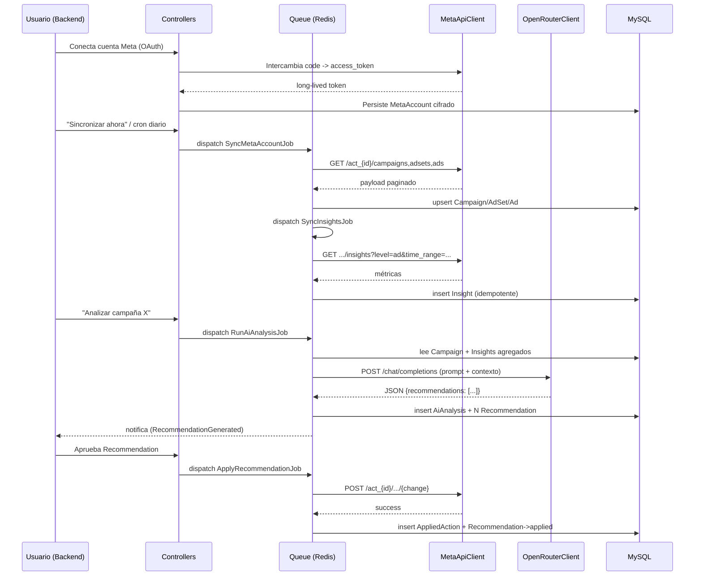

# Design Document: Master Ads

## Overview

Plugin OctoberCMS 4 (`Aero\MasterAds`) que actúa como SaaS optimizador de campañas Meta Ads asistido por IA: sincroniza cuentas/campañas/adsets/ads y métricas vía Meta Graph API, ejecuta análisis con LLMs (OpenRouter + Claude por defecto) y produce recomendaciones aplicables (cambios de presupuesto, segmentación, pausas, escalados) con trazabilidad completa. Esta versión es **MVP backend-only**, totalmente compatible con RainLab Builder (estructura estándar de modelos, controladores y migraciones).

---

## Arquitectura del Plugin

```
plugins/aero/masterads/
├── Plugin.php
├── routes.php                              # Webhooks Meta + OAuth callback
├── composer.json
│
├── classes/
│   ├── Meta/
│   │   ├── MetaApiClient.php               # HTTP wrapper Graph API v19+
│   │   ├── MetaOAuthService.php            # Authorization code flow
│   │   └── MetaTokenRefresher.php          # Long-lived token rotation
│   ├── Ai/
│   │   ├── AiProviderInterface.php         # Contract
│   │   ├── OpenRouterClient.php            # Default implementation
│   │   ├── PromptBuilder.php               # Compone prompts contextuales
│   │   └── ResponseParser.php              # Parsea JSON de la LLM
│   ├── Engine/
│   │   ├── RecommendationEngine.php        # Orquesta análisis
│   │   ├── RecommendationApplier.php       # Aplica cambios a Meta
│   │   └── MetricsAggregator.php           # KPIs derivados
│   └── Billing/
│       ├── PlanLimiter.php                 # Cuotas por suscripción
│       └── UsageMeter.php                  # Registro de uso
│
├── models/
│   ├── Workspace/                          # Multi-tenant
│   ├── MetaAccount/
│   ├── Campaign/
│   ├── AdSet/
│   ├── Ad/
│   ├── Insight/                            # Métricas time-series
│   ├── AiAnalysis/
│   ├── Recommendation/
│   ├── AppliedAction/                      # Audit trail
│   ├── AiProvider/                         # Multi-LLM configurable
│   ├── Plan/
│   ├── Subscription/
│   └── UsageRecord/
│
├── controllers/                            # FormController/ListController/RelationController
│   ├── Workspaces.php
│   ├── MetaAccounts.php
│   ├── Campaigns.php
│   ├── AdSets.php
│   ├── Ads.php
│   ├── Recommendations.php
│   ├── AiAnalyses.php
│   ├── AiProviders.php
│   ├── Plans.php
│   └── Subscriptions.php
│
├── jobs/
│   ├── SyncMetaAccountJob.php              # Sync incremental por cuenta
│   ├── SyncInsightsJob.php                 # Métricas diarias
│   ├── RunAiAnalysisJob.php                # Llamada al LLM
│   └── ApplyRecommendationJob.php          # Push a Meta API
│
├── console/
│   ├── SyncAllCommand.php                  # masterads:sync-all
│   ├── AnalyzeCommand.php                  # masterads:analyze
│   └── RotateTokensCommand.php             # masterads:rotate-tokens
│
├── observers/
│   ├── RecommendationObserver.php          # Auto-aplica si plan lo permite
│   └── SubscriptionObserver.php            # Resetea cuotas en renovación
│
├── events/
│   ├── RecommendationGenerated.php
│   ├── RecommendationApplied.php
│   └── SyncCompleted.php
│
├── listeners/
│   └── NotifyRecommendationListener.php
│
├── lang/
│   └── es/lang.php
│
└── updates/
    ├── version.yaml
    └── create_*.php                        # 13 migraciones
```

---

## Main Algorithm/Workflow — Ciclo de optimización



---

## Core Interfaces/Types

### Modelos Eloquent (firmas)

```php
<?php
namespace Aero\MasterAds\Models;

use Model;
use October\Rain\Database\Traits\Validation;
use October\Rain\Database\Traits\SoftDelete;

/**
 * Tenant del SaaS. Aísla recursos entre clientes.
 */
class Workspace extends Model
{
    public $table = 'aero_masterads_workspaces';
    public $rules = [
        'name'      => 'required|max:120',
        'slug'      => 'required|alpha_dash|unique:aero_masterads_workspaces,slug',
        'owner_id'  => 'required|exists:backend_users,id',
    ];
    public $hasMany = [
        'meta_accounts' => MetaAccount::class,
        'subscriptions' => Subscription::class,
    ];
    public $belongsTo = [
        'owner' => [\Backend\Models\User::class, 'key' => 'owner_id'],
    ];
    public $belongsToMany = [
        'members' => [
            \Backend\Models\User::class,
            'table'    => 'aero_masterads_workspace_user',
            'pivot'    => ['role'],     // owner|admin|viewer
        ],
    ];
}

/**
 * Cuenta publicitaria Meta conectada vía OAuth.
 * El access_token se almacena cifrado (Crypt::encrypt).
 */
class MetaAccount extends Model
{
    public $table = 'aero_masterads_meta_accounts';
    protected $hidden = ['access_token', 'refresh_token'];
    public $rules = [
        'workspace_id' => 'required|exists:aero_masterads_workspaces,id',
        'meta_act_id'  => 'required|regex:/^act_\d+$/',
        'currency'     => 'required|size:3',
    ];
    public $belongsTo = ['workspace' => Workspace::class];
    public $hasMany   = ['campaigns' => Campaign::class];

    public function getAccessTokenAttribute($value): ?string;     // decrypt al leer
    public function setAccessTokenAttribute(string $value): void; // encrypt al setear
    public function isTokenExpired(): bool;
}

class Campaign extends Model
{
    public $table = 'aero_masterads_campaigns';
    public $rules = [
        'meta_account_id' => 'required|exists:aero_masterads_meta_accounts,id',
        'meta_id'         => 'required|string|unique:aero_masterads_campaigns,meta_id',
        'name'            => 'required|max:255',
        'objective'       => 'required',
        'status'          => 'required|in:ACTIVE,PAUSED,ARCHIVED,DELETED',
    ];
    public $belongsTo = ['meta_account' => MetaAccount::class];
    public $hasMany   = ['ad_sets' => AdSet::class, 'insights' => Insight::class];
}

class AdSet extends Model { /* análogo, FK campaign_id */ }
class Ad    extends Model { /* análogo, FK ad_set_id, attachOne creative */ }

/**
 * Métricas diarias por entidad (campaign|adset|ad). Time-series.
 * Indice único (entity_type, entity_id, date) garantiza idempotencia.
 */
class Insight extends Model
{
    public $table = 'aero_masterads_insights';
    public $timestamps = false;
    public $rules = [
        'entity_type' => 'required|in:campaign,adset,ad',
        'entity_id'   => 'required|integer',
        'date'        => 'required|date',
        'impressions' => 'required|integer|min:0',
        'clicks'      => 'required|integer|min:0',
        'spend'       => 'required|numeric|min:0',
        'conversions' => 'required|integer|min:0',
    ];
}

/**
 * Una corrida de análisis IA. Agrupa N Recommendation hijas.
 */
class AiAnalysis extends Model
{
    use SoftDelete;
    public $table = 'aero_masterads_ai_analyses';
    public $rules = [
        'workspace_id'    => 'required|exists:aero_masterads_workspaces,id',
        'ai_provider_id'  => 'required|exists:aero_masterads_ai_providers,id',
        'target_type'     => 'required|in:campaign,adset,ad',
        'target_id'       => 'required|integer',
        'status'          => 'required|in:queued,running,success,failed',
    ];
    public $jsonable = ['prompt_payload', 'raw_response', 'metrics_snapshot'];
    public $hasMany = ['recommendations' => Recommendation::class];
}

/**
 * Sugerencia individual: cambio atómico aplicable a Meta.
 */
class Recommendation extends Model
{
    public $table = 'aero_masterads_recommendations';
    public $rules = [
        'ai_analysis_id' => 'required|exists:aero_masterads_ai_analyses,id',
        'action_type'    => 'required|in:adjust_budget,pause,resume,scale,change_audience,change_creative',
        'severity'       => 'required|in:low,medium,high,critical',
        'status'         => 'required|in:pending,approved,rejected,applied,failed',
        'rationale'      => 'required|string',
    ];
    public $jsonable = ['payload', 'expected_impact'];
    public $belongsTo = ['ai_analysis' => AiAnalysis::class];
    public $hasOne    = ['applied_action' => AppliedAction::class];
}

/**
 * Audit trail inmutable de un cambio enviado a Meta.
 */
class AppliedAction extends Model
{
    public $table = 'aero_masterads_applied_actions';
    public $jsonable = ['before_state', 'after_state', 'meta_response'];
    public $rules = [
        'recommendation_id' => 'required|exists:aero_masterads_recommendations,id',
        'applied_by'        => 'required|exists:backend_users,id',
        'success'           => 'required|boolean',
    ];
}

class AiProvider extends Model
{
    public $table = 'aero_masterads_ai_providers';
    protected $hidden = ['api_key'];
    public $rules = [
        'name'    => 'required|max:120',
        'driver'  => 'required|in:openrouter,openai,anthropic,custom',
        'model'   => 'required|string',     // ej: anthropic/claude-3.5-sonnet
        'api_key' => 'required',
        'is_default' => 'boolean',
    ];
    public $jsonable = ['settings'];        // temperature, max_tokens, base_url
}

class Plan extends Model
{
    public $table = 'aero_masterads_plans';
    public $rules = [
        'code'                 => 'required|alpha_dash|unique:aero_masterads_plans,code',
        'monthly_price'        => 'required|numeric|min:0',
        'max_meta_accounts'    => 'required|integer|min:1',
        'max_analyses_month'   => 'required|integer|min:1',
        'auto_apply_allowed'   => 'required|boolean',
    ];
}

class Subscription extends Model
{
    public $table = 'aero_masterads_subscriptions';
    public $rules = [
        'workspace_id' => 'required|exists:aero_masterads_workspaces,id',
        'plan_id'      => 'required|exists:aero_masterads_plans,id',
        'status'       => 'required|in:active,past_due,canceled,trialing',
        'period_start' => 'required|date',
        'period_end'   => 'required|date|after:period_start',
    ];
    public $belongsTo = ['workspace' => Workspace::class, 'plan' => Plan::class];
}

class UsageRecord extends Model
{
    public $table = 'aero_masterads_usage_records';
    public $rules = [
        'subscription_id' => 'required|exists:aero_masterads_subscriptions,id',
        'metric'          => 'required|in:analysis,sync,applied_action',
        'qty'             => 'required|integer|min:1',
        'recorded_at'     => 'required|date',
    ];
}
```

### Contratos de servicios

```php
<?php
namespace Aero\MasterAds\Classes\Ai;

interface AiProviderInterface
{
    /**
     * Ejecuta una llamada de chat completion con salida JSON estructurada.
     *
     * @param  string $systemPrompt   instrucción de rol/formato
     * @param  string $userPrompt     payload con contexto y métricas
     * @param  array  $options        ['temperature'=>0.2,'max_tokens'=>4000,'json_schema'=>...]
     * @return AiResponse             objeto con raw, parsed, tokens, cost_usd
     * @throws AiProviderException    en error de red, rate-limit o parseo
     */
    public function complete(string $systemPrompt, string $userPrompt, array $options = []): AiResponse;

    /** Identificador del modelo en uso (ej. anthropic/claude-3.5-sonnet). */
    public function model(): string;

    /** Estimación de costo en USD para una respuesta dada. */
    public function estimateCost(int $promptTokens, int $completionTokens): float;
}

final class AiResponse
{
    public function __construct(
        public readonly string $raw,
        public readonly array  $parsed,
        public readonly int    $promptTokens,
        public readonly int    $completionTokens,
        public readonly float  $costUsd,
        public readonly string $model
    ) {}
}
```

```php
<?php
namespace Aero\MasterAds\Classes\Meta;

interface MetaApiClientInterface
{
    /** GET paginado, sigue cursores hasta agotar; respeta rate-limits. */
    public function getPaginated(string $endpoint, array $params = []): iterable;

    /** Operación POST/DELETE; reintenta exponencial en errores transitorios. */
    public function call(string $method, string $endpoint, array $params = []): array;

    /** Refresca un long-lived token expirado. */
    public function refreshToken(MetaAccount $account): void;
}
```

```php
<?php
namespace Aero\MasterAds\Classes\Engine;

interface RecommendationEngineInterface
{
    /**
     * Genera recomendaciones para un target (campaign|adset|ad).
     *
     * @param  string $targetType
     * @param  int    $targetId
     * @param  array  $options ['lookback_days'=>14,'force_provider'=>null]
     * @return AiAnalysis      con sus Recommendation hijas persistidas
     */
    public function analyze(string $targetType, int $targetId, array $options = []): AiAnalysis;
}

interface RecommendationApplierInterface
{
    /**
     * Aplica una Recommendation aprobada a Meta y registra audit trail.
     * Idempotente: aplicar dos veces la misma Recommendation no genera doble cambio.
     */
    public function apply(Recommendation $rec, int $appliedByUserId): AppliedAction;
}
```

---

## Key Functions with Formal Specifications

### `MetaOAuthService::exchangeCode()`

```php
public function exchangeCode(string $code, int $workspaceId): MetaAccount
```

**Preconditions:**
- `$code` no está vacío y proviene del callback OAuth de Meta (`?code=...`).
- `$workspaceId` referencia un Workspace existente del que el usuario actual es `owner` o `admin`.
- Las credenciales `META_APP_ID` y `META_APP_SECRET` están definidas en `config/services.php`.

**Postconditions:**
- Si éxito: existe un registro `MetaAccount` con `access_token` cifrado y `expires_at` ≥ now()+30 días.
- El registro queda asociado al `Workspace` indicado.
- Se dispara evento `MetaAccountConnected`.
- Si la cuenta ya existía (mismo `meta_act_id` + workspace), se actualiza el token (no se duplica).
- Si error de Meta: lanza `MetaOAuthException` y NO se persiste nada (transacción atómica).

**Loop Invariants:** N/A (sin bucles).

---

### `MetaApiClient::getPaginated()`

```php
public function getPaginated(string $endpoint, array $params = []): iterable
```

**Preconditions:**
- `$endpoint` empieza con `/` y referencia un recurso válido de Graph API.
- El cliente fue construido con un `MetaAccount` cuyo token NO está expirado (o se refrescará automáticamente).

**Postconditions:**
- Devuelve un generator que emite cada elemento de `data` de cada página.
- Sigue `paging.next` hasta que sea `null`.
- En 429 / 613 (rate limit): aplica backoff exponencial (1s, 2s, 4s, 8s, 16s) hasta máx. 5 reintentos.
- Tras 5 fallos consecutivos: lanza `MetaApiRateLimitException`.
- El consumidor puede romper el iterable temprano sin desperdiciar requests.

**Loop Invariants:**
- Antes de cada iteración: `cursor !== null` ⟹ aún quedan páginas por leer.
- Tras cada `yield`: el contador de elementos emitidos ≥ 0 y monotónicamente creciente.
- En todo momento: `retries_used ≤ MAX_RETRIES (=5)`.

---

### `RecommendationEngine::analyze()`

```php
public function analyze(string $targetType, int $targetId, array $options = []): AiAnalysis
```

**Preconditions:**
- `$targetType ∈ {'campaign','adset','ad'}`.
- Existe un registro del tipo indicado con id `$targetId`.
- El Workspace dueño del target tiene una `Subscription` activa.
- `PlanLimiter::canRunAnalysis($workspace)` devuelve `true` (cuota disponible).
- Existe al menos un `AiProvider` activo (`is_default=true` por defecto).
- El target tiene ≥ 7 días de `Insight` registrados (umbral mínimo de datos).

**Postconditions:**
- Se crea exactamente un `AiAnalysis` con `status` final `success` o `failed`.
- Si `success`: existen N ≥ 0 `Recommendation` hijas, cada una con `payload` no nulo y `rationale` no vacío.
- Se incrementa `UsageMeter` con `metric='analysis'`, `qty=1`.
- Se dispara `RecommendationGenerated` con el `AiAnalysis` adjunto.
- Si `failed`: `AiAnalysis.status='failed'`, `error_message` poblado, NO se cuenta en cuota, NO se generan Recommendations huérfanas.
- En cualquier caso: `metrics_snapshot` contiene el agregado usado para generar el prompt (reproducibilidad).

**Loop Invariants:** N/A (orquestación lineal; loops internos están en `MetricsAggregator`).

---

### `RecommendationApplier::apply()`

```php
public function apply(Recommendation $rec, int $appliedByUserId): AppliedAction
```

**Preconditions:**
- `$rec->status === 'approved'`.
- El usuario `$appliedByUserId` tiene permiso `aero.masterads.apply_recommendations` en el Workspace del target.
- El `MetaAccount` asociado tiene token válido.
- No existe ya una `AppliedAction` con éxito para este `recommendation_id` (idempotencia).

**Postconditions:**
- Si éxito: `$rec->status='applied'`, existe `AppliedAction` con `success=true`, `before_state` y `after_state` poblados.
- Si fallo: `$rec->status='failed'`, existe `AppliedAction` con `success=false` y `meta_response` con detalle.
- En éxito: se dispara `RecommendationApplied`.
- Operación envuelta en transacción DB; el call a Meta ocurre DENTRO de la transacción y un fallo posterior al persistir hace rollback del estado del `Recommendation` pero NO del cambio remoto (compensación queda en `AppliedAction.success=false` con flag de inconsistencia).

**Loop Invariants:** N/A.

---

### `PlanLimiter::canRunAnalysis()`

```php
public function canRunAnalysis(Workspace $ws): bool
```

**Preconditions:**
- `$ws` tiene una relación `subscriptions` cargable.

**Postconditions:**
- Devuelve `true` si y solo si:
  - Existe `Subscription` activa (`status='active'` o `'trialing'`) AND
  - `count(UsageRecord where subscription_id=... AND metric='analysis' AND recorded_at within current period) < plan.max_analyses_month`.
- No tiene efectos secundarios (función pura sobre el estado de la BD).

**Loop Invariants:** N/A.

---

## Algorithmic Pseudocode

### Algoritmo 1: Sincronización incremental de cuenta Meta

```pascal
ALGORITHM SyncMetaAccountJob.handle(metaAccount)
INPUT:  metaAccount of type MetaAccount
OUTPUT: void (efecto: filas upsertadas en campaigns/ad_sets/ads, jobs encolados)

BEGIN
  ASSERT metaAccount IS NOT NULL
  ASSERT metaAccount.access_token IS NOT empty

  // 1. Refresh token si está cerca de expirar (<7 días)
  IF metaAccount.expires_at - now() < 7 days THEN
    MetaTokenRefresher.refresh(metaAccount)
    ASSERT metaAccount.expires_at > now() + 30 days
  END IF

  client ← new MetaApiClient(metaAccount)
  syncCursor ← metaAccount.last_synced_at OR (now() - 30 days)

  // 2. Sync campañas (loop con invariante)
  FOR each campaign IN client.getPaginated('/' + metaAccount.meta_act_id + '/campaigns',
       {fields: [id,name,objective,status,daily_budget,...], updated_since: syncCursor}) DO

    INVARIANT: todas las Campaign upsertadas hasta este punto
               son consistentes con el payload de Meta (FK válidas, status normalizado)

    Campaign.upsertByMetaId(campaign, metaAccount.id)
  END FOR

  // 3. Sync adsets y ads (mismo patrón)
  FOR each adSet IN client.getPaginated('/.../adsets', {...}) DO
    AdSet.upsertByMetaId(adSet, parentCampaignId)
  END FOR
  FOR each ad IN client.getPaginated('/.../ads', {...}) DO
    Ad.upsertByMetaId(ad, parentAdSetId)
  END FOR

  // 4. Encolar sync de insights (separado para no bloquear)
  Queue.dispatch(new SyncInsightsJob(metaAccount, syncCursor, today))

  // 5. Marcar sync completo
  metaAccount.last_synced_at ← now()
  metaAccount.save()

  Event.fire(new SyncCompleted(metaAccount))

  ASSERT metaAccount.last_synced_at = now()  // postcondition
END
```

**Preconditions:** `metaAccount` existe; conexión a internet disponible; queue Redis activa.

**Postconditions:** `metaAccount.last_synced_at = now()`; todas las entidades activas en Meta se reflejan en la BD local; un `SyncInsightsJob` queda encolado.

**Loop Invariants:**
- Tras cada iteración del bucle de campañas: el conjunto de Campaigns persistidas es subconjunto consistente de las que Meta reportó.
- `syncCursor` no se mueve durante el job (snapshot).

---

### Algoritmo 2: Generación de recomendaciones IA

```pascal
ALGORITHM RecommendationEngine.analyze(targetType, targetId, options)
INPUT:  targetType ∈ {campaign, adset, ad}, targetId integer, options array
OUTPUT: aiAnalysis of type AiAnalysis

BEGIN
  // 1. Validación y carga
  target ← loadTarget(targetType, targetId)
  ASSERT target IS NOT NULL
  workspace ← target.workspace()
  ASSERT PlanLimiter.canRunAnalysis(workspace) = true  // throw QuotaExceededException si no

  provider ← AiProviderResolver.resolve(options.force_provider OR workspace.default_provider)
  ASSERT provider IS NOT NULL

  // 2. Crear AiAnalysis en estado 'queued' -> 'running' (transacción)
  analysis ← AiAnalysis.create({
    workspace_id: workspace.id,
    ai_provider_id: provider.id,
    target_type: targetType,
    target_id: targetId,
    status: 'running'
  })

  TRY
    // 3. Agregar métricas (loop)
    snapshot ← {entity: target.toArray(), period: options.lookback_days OR 14}

    FOR each insight IN target.insights().lookback(snapshot.period).get() DO
      INVARIANT: snapshot.metrics_aggregated contiene la suma correcta de
                 todos los insights procesados hasta ahora
      MetricsAggregator.fold(snapshot, insight)
    END FOR

    derived ← MetricsAggregator.finalize(snapshot)
    // CTR = clicks/impressions, CPC = spend/clicks, ROAS = revenue/spend, etc.

    analysis.metrics_snapshot ← snapshot ∪ derived

    // 4. Construir prompt
    systemPrompt ← PromptBuilder.system(targetType)
    userPrompt   ← PromptBuilder.user(target, snapshot, derived, options)
    analysis.prompt_payload ← {system: systemPrompt, user: userPrompt}

    // 5. Llamar al LLM
    response ← provider.complete(systemPrompt, userPrompt,
                                 {temperature: 0.2, max_tokens: 4000,
                                  json_schema: RECOMMENDATION_SCHEMA})

    analysis.raw_response ← response.raw
    analysis.tokens_used ← response.promptTokens + response.completionTokens
    analysis.cost_usd ← response.costUsd

    // 6. Parsear y validar (loop)
    parsedRecs ← ResponseParser.parse(response, RECOMMENDATION_SCHEMA)
    ASSERT parsedRecs IS array

    FOR each rec IN parsedRecs DO
      INVARIANT: todas las Recommendation insertadas hasta ahora pertenecen
                 al analysis actual y pasan validación de schema

      IF NOT RecommendationValidator.validate(rec, target) THEN
        CONTINUE  // descartar inválidas, no abortar análisis
      END IF

      Recommendation.create({
        ai_analysis_id: analysis.id,
        action_type: rec.action_type,
        severity: rec.severity,
        rationale: rec.rationale,
        payload: rec.payload,
        expected_impact: rec.expected_impact,
        status: 'pending'
      })
    END FOR

    // 7. Cerrar exitosamente
    analysis.status ← 'success'
    analysis.save()
    UsageMeter.record(workspace.activeSubscription, 'analysis', 1)
    Event.fire(new RecommendationGenerated(analysis))

  CATCH AiProviderException as e
    analysis.status ← 'failed'
    analysis.error_message ← e.getMessage()
    analysis.save()
    // NO se cuenta en cuota
    RETHROW e
  END TRY

  ASSERT analysis.status ∈ {'success', 'failed'}  // postcondition
  RETURN analysis
END
```

**Preconditions:** ver sección anterior de `analyze()`.

**Postconditions:** Existe un `AiAnalysis` persistido en estado terminal; en éxito, sus Recommendations son todas válidas contra schema y target.

**Loop Invariants:**
- Bucle de insights: el snapshot agregado es siempre la fold-suma de los insights procesados.
- Bucle de recomendaciones: cualquier Recommendation persistida pertenece al `AiAnalysis` actual y no está corrupta.

---

### Algoritmo 3: Aplicación idempotente de recomendación

```pascal
ALGORITHM RecommendationApplier.apply(rec, appliedByUserId)
INPUT:  rec of type Recommendation, appliedByUserId integer
OUTPUT: action of type AppliedAction

BEGIN
  ASSERT rec.status = 'approved'

  // 1. Idempotencia: si ya fue aplicada con éxito, devolver la AppliedAction existente
  existing ← AppliedAction.where('recommendation_id', rec.id).where('success', true).first()
  IF existing IS NOT NULL THEN
    RETURN existing
  END IF

  target ← loadTargetForRecommendation(rec)
  metaAccount ← target.metaAccount()
  ASSERT metaAccount.access_token IS NOT empty

  client ← new MetaApiClient(metaAccount)

  // 2. Snapshot estado previo
  beforeState ← client.call('GET', '/' + target.meta_id, {fields: relevantFields(rec.action_type)})

  // 3. Despachar acción según action_type
  TRY (DB transaction)
    metaResponse ← NULL
    SWITCH rec.action_type
      CASE 'adjust_budget':
        ASSERT rec.payload.daily_budget > 0
        metaResponse ← client.call('POST', '/' + target.meta_id,
                                   {daily_budget: rec.payload.daily_budget * 100})  // centavos
      CASE 'pause':
        metaResponse ← client.call('POST', '/' + target.meta_id, {status: 'PAUSED'})
      CASE 'resume':
        metaResponse ← client.call('POST', '/' + target.meta_id, {status: 'ACTIVE'})
      CASE 'scale':
        newBudget ← beforeState.daily_budget * rec.payload.multiplier
        metaResponse ← client.call('POST', '/' + target.meta_id, {daily_budget: newBudget})
      CASE 'change_audience':
        ASSERT target IS AdSet  // sólo aplicable a adsets
        metaResponse ← client.call('POST', '/' + target.meta_id,
                                   {targeting: rec.payload.targeting})
      CASE 'change_creative':
        ASSERT target IS Ad
        metaResponse ← client.call('POST', '/' + target.meta_id,
                                   {creative: {creative_id: rec.payload.creative_id}})
      DEFAULT:
        THROW UnsupportedActionTypeException(rec.action_type)
    END SWITCH

    // 4. Snapshot estado posterior
    afterState ← client.call('GET', '/' + target.meta_id, {fields: relevantFields(rec.action_type)})

    // 5. Persistir audit trail + actualizar rec
    action ← AppliedAction.create({
      recommendation_id: rec.id,
      applied_by: appliedByUserId,
      success: true,
      before_state: beforeState,
      after_state: afterState,
      meta_response: metaResponse
    })
    rec.status ← 'applied'
    rec.save()

    UsageMeter.record(target.workspace.activeSubscription, 'applied_action', 1)
    Event.fire(new RecommendationApplied(rec, action))

  CATCH MetaApiException as e
    // Persistir el fallo igual (auditoría) fuera de la transacción
    action ← AppliedAction.create({
      recommendation_id: rec.id,
      applied_by: appliedByUserId,
      success: false,
      before_state: beforeState,
      after_state: NULL,
      meta_response: {error: e.getMessage(), code: e.getCode()}
    })
    rec.status ← 'failed'
    rec.save()
    RETHROW e
  END TRY

  ASSERT action IS NOT NULL
  ASSERT (action.success = true) ⟹ (rec.status = 'applied')
  RETURN action
END
```

**Preconditions:** ver sección anterior de `apply()`.

**Postconditions:** Existe exactamente una `AppliedAction` con `success=true` por cada `Recommendation` exitosamente aplicada; el estado de `Recommendation` es terminal (`applied` o `failed`).

**Loop Invariants:** N/A.

---

## Example Usage

### Conectar cuenta Meta y sincronizar

```php
use Aero\MasterAds\Classes\Meta\MetaOAuthService;
use Aero\MasterAds\Jobs\SyncMetaAccountJob;

// 1. En el callback OAuth (routes.php → controlador)
Route::get('aero/masterads/oauth/meta/callback', function () {
    $code = request('code');
    $workspaceId = session('aero.masterads.connecting_workspace');

    /** @var MetaOAuthService $oauth */
    $oauth = app(MetaOAuthService::class);
    $metaAccount = $oauth->exchangeCode($code, $workspaceId);

    // 2. Lanzar primer sync en background
    SyncMetaAccountJob::dispatch($metaAccount);

    return redirect('backend/aero/masterads/metaaccounts/preview/' . $metaAccount->id);
});
```

### Ejecutar análisis IA manual desde controller backend

```php
namespace Aero\MasterAds\Controllers;

use Backend\Classes\Controller;
use Aero\MasterAds\Jobs\RunAiAnalysisJob;
use Aero\MasterAds\Models\Campaign;

class Campaigns extends Controller
{
    public $implement = [
        \Backend\Behaviors\FormController::class,
        \Backend\Behaviors\ListController::class,
        \Backend\Behaviors\RelationController::class,
    ];

    public $requiredPermissions = ['aero.masterads.access_campaigns'];

    public function onAnalyzeNow(int $recordId): array
    {
        $this->authorize('aero.masterads.run_analysis');

        $campaign = Campaign::findOrFail($recordId);
        RunAiAnalysisJob::dispatch('campaign', $campaign->id, [
            'lookback_days' => 14,
            'triggered_by'  => $this->user->id,
        ]);

        \Flash::success('Análisis encolado. Recibirás una notificación cuando termine.');
        return ['#campaign-actions' => $this->makePartial('analyze_status', ['campaign' => $campaign])];
    }
}
```

### Aplicar una recomendación aprobada

```php
use Aero\MasterAds\Classes\Engine\RecommendationApplierInterface;
use Aero\MasterAds\Models\Recommendation;

$rec = Recommendation::findOrFail($id);
$rec->status = 'approved';
$rec->save();

/** @var RecommendationApplierInterface $applier */
$applier = app(RecommendationApplierInterface::class);
$action = $applier->apply($rec, BackendAuth::getUser()->id);

if ($action->success) {
    \Flash::success("Recomendación aplicada. Cambio: {$rec->action_type}");
} else {
    \Flash::error("Falló: " . ($action->meta_response['error'] ?? 'desconocido'));
}
```

### Configurar proveedor IA (OpenRouter + Claude por defecto)

```php
use Aero\MasterAds\Models\AiProvider;

AiProvider::create([
    'name'       => 'OpenRouter — Claude 3.5 Sonnet',
    'driver'     => 'openrouter',
    'model'      => 'anthropic/claude-3.5-sonnet',
    'api_key'    => env('OPENROUTER_API_KEY'),
    'is_default' => true,
    'settings'   => [
        'base_url'    => 'https://openrouter.ai/api/v1',
        'temperature' => 0.2,
        'max_tokens'  => 4000,
        'http_referer'=> 'https://masterads.example.com',
        'x_title'     => 'Master Ads',
    ],
]);
```

### Schedule de sincronización + análisis

```php
// Plugin.php
public function registerSchedule($schedule): void
{
    // Sync cada 4 horas
    $schedule->command('masterads:sync-all')
        ->everyFourHours()
        ->withoutOverlapping()
        ->onOneServer();

    // Rotación de tokens diaria
    $schedule->command('masterads:rotate-tokens')
        ->dailyAt('03:00')
        ->withoutOverlapping();

    // Análisis automático para workspaces con auto-analyze=true
    $schedule->command('masterads:analyze --auto')
        ->dailyAt('06:00')
        ->withoutOverlapping();
}
```

---

## Correctness Properties

Las siguientes propiedades son invariantes del sistema. Toda implementación debe satisfacerlas y los tests property-based (sección Testing) deben verificarlas.

```php
// P1. Idempotencia de aplicación de recomendación
//     ∀ rec ∈ Recommendation:
//     applier.apply(rec, u) llamado N veces ≡ aplicado a Meta exactamente 1 vez
//     ∧ count(AppliedAction where rec_id=rec.id ∧ success=true) ≤ 1
property_idempotent_apply: ∀ rec, ∀ N ≥ 1:
    apply_n_times(rec, N).meta_calls_count == 1

// P2. Aislamiento multi-tenant
//     ∀ workspace W1, W2 con W1 ≠ W2:
//     query(MetaAccount where workspace_id = W1.id) ∩ W2.meta_accounts = ∅
property_tenant_isolation: ∀ w1 ≠ w2:
    w1.meta_accounts ∩ w2.meta_accounts == ∅
    ∧ w1.recommendations ∩ w2.recommendations == ∅

// P3. Conservación de cuota
//     ∀ subscription S, ∀ período P:
//     count(UsageRecord en P) ≤ S.plan.max_analyses_month
//     (forzado por PlanLimiter ANTES de iniciar análisis)
property_quota_enforced: ∀ s ∈ Subscription, ∀ p ∈ period(s):
    sum(usage.qty where metric='analysis' ∧ in(p)) ≤ s.plan.max_analyses_month

// P4. Conservación de métricas (idempotencia de sync)
//     ∀ metaAccount, ∀ date:
//     ejecutar SyncInsightsJob(metaAccount, date) N veces ≡ ejecutarlo 1 vez
//     (gracias a UNIQUE(entity_type, entity_id, date))
property_sync_idempotent: ∀ acc, ∀ d:
    sync_n_times(acc, d, N).insight_count == sync_once(acc, d).insight_count

// P5. Trazabilidad total
//     ∀ AppliedAction A:
//     A.before_state ≠ NULL
//     ∧ A.success = true ⟹ A.after_state ≠ NULL ∧ A.recommendation.status = 'applied'
//     ∧ A.success = false ⟹ A.recommendation.status = 'failed'
property_audit_trail_complete: ∀ a ∈ AppliedAction:
    a.before_state ≠ NULL
    ∧ (a.success ⟹ a.after_state ≠ NULL ∧ a.recommendation.status == 'applied')
    ∧ (¬a.success ⟹ a.recommendation.status == 'failed')

// P6. Confidencialidad de tokens
//     ∀ MetaAccount A: el campo access_token NUNCA aparece en respuestas JSON
//     ∧ A.access_token en BD está cifrado con la APP_KEY
property_token_confidential: ∀ a ∈ MetaAccount:
    a.toArray() does NOT contain 'access_token'
    ∧ db_raw(a).access_token ≠ a.access_token  // raw está cifrado

// P7. Atomicidad de OAuth
//     ∀ exchangeCode(code, ws):
//     resultado ∈ {MetaAccount creado/actualizado completo, ningún cambio}
//     (NO existe estado intermedio: ej. fila parcial sin token)
property_oauth_atomic: ∀ code, ∀ ws:
    after exchangeCode: db_state ∈ {fully_committed, fully_rolled_back}

// P8. Schema de respuesta IA
//     ∀ Recommendation R:
//     R.payload satisface JSON_SCHEMA(R.action_type)
//     (validado en RecommendationValidator antes de persistir)
property_recommendation_schema: ∀ r ∈ Recommendation:
    validate(r.payload, schema_for(r.action_type)) == true

// P9. Compatibilidad RainLab Builder
//     Para todo Model: existe carpeta /models/{name}/ con fields.yaml + columns.yaml
//     Para todo Controller: existe /controllers/{name}/ con config_form.yaml + config_list.yaml
//     Todas las migraciones siguen el patrón <verb>_<table>_table.php
property_builder_compatible:
    ∀ model in models/: exists(models/{model}/fields.yaml) ∧ exists(models/{model}/columns.yaml)
    ∀ controller in controllers/: exists(controllers/{controller}/config_form.yaml)
                                ∧ exists(controllers/{controller}/config_list.yaml)
```

### Tests sugeridos (property-based con Pest/PHPUnit)

```php
// tests/PropertyBased/IdempotencyTest.php
it('aplica una recomendación aprobada exactamente una vez sin importar N llamadas', function () {
    $rec = Recommendation::factory()->approved()->create();

    Http::fake(['graph.facebook.com/*' => Http::response(['success' => true])]);

    foreach (range(1, 5) as $_) {
        app(RecommendationApplierInterface::class)->apply($rec, $userId);
    }

    expect(AppliedAction::where('recommendation_id', $rec->id)->where('success', true)->count())
        ->toBeLessThanOrEqual(1);
    Http::assertSentCount(1);
});

it('respeta el límite de cuota del plan en N intentos concurrentes', function (int $n) {
    // Property: count(UsageRecord) ≤ plan.max_analyses_month tras N análisis
})->with([1, 5, 10, 50]);
```

---

## Permisos backend (registerPermissions)

```php
public function registerPermissions(): array
{
    return [
        'aero.masterads.access_plugin' => [
            'tab'   => 'Master Ads',
            'label' => 'Acceder al plugin',
        ],
        'aero.masterads.manage_workspaces'    => ['tab' => 'Master Ads', 'label' => 'Gestionar workspaces'],
        'aero.masterads.manage_meta_accounts' => ['tab' => 'Master Ads', 'label' => 'Conectar/desconectar cuentas Meta'],
        'aero.masterads.access_campaigns'     => ['tab' => 'Master Ads', 'label' => 'Ver campañas/adsets/ads'],
        'aero.masterads.run_analysis'         => ['tab' => 'Master Ads', 'label' => 'Ejecutar análisis IA'],
        'aero.masterads.review_recommendations' => ['tab' => 'Master Ads', 'label' => 'Aprobar/rechazar recomendaciones'],
        'aero.masterads.apply_recommendations' => ['tab' => 'Master Ads', 'label' => 'Aplicar cambios a Meta'],
        'aero.masterads.manage_ai_providers'  => ['tab' => 'Master Ads', 'label' => 'Configurar proveedores IA'],
        'aero.masterads.manage_billing'       => ['tab' => 'Master Ads', 'label' => 'Gestionar planes y suscripciones'],
    ];
}
```

---

## Migraciones (orden de creación)

```
updates/
├── version.yaml
├── 1.0.1_create_workspaces_table.php
├── 1.0.2_create_workspace_user_table.php
├── 1.0.3_create_plans_table.php
├── 1.0.4_create_subscriptions_table.php
├── 1.0.5_create_usage_records_table.php
├── 1.0.6_create_ai_providers_table.php
├── 1.0.7_create_meta_accounts_table.php
├── 1.0.8_create_campaigns_table.php
├── 1.0.9_create_ad_sets_table.php
├── 1.0.10_create_ads_table.php
├── 1.0.11_create_insights_table.php
├── 1.0.12_create_ai_analyses_table.php
├── 1.0.13_create_recommendations_table.php
└── 1.0.14_create_applied_actions_table.php
```

Índices críticos:

```php
// insights
$table->unique(['entity_type', 'entity_id', 'date']);   // P4: idempotencia sync
$table->index(['entity_type', 'entity_id', 'date']);    // queries de lookback

// recommendations
$table->index(['ai_analysis_id', 'status']);
$table->index(['status', 'severity']);                  // dashboard backend

// usage_records
$table->index(['subscription_id', 'metric', 'recorded_at']);  // P3: cálculo cuota

// applied_actions
$table->unique(['recommendation_id', 'success']);       // P1: idempotencia (parcial: solo 1 success)
```

---

## Dependencias

| Dependencia | Versión | Uso |
|-------------|---------|-----|
| `october/rain` | ^4.2 | Core OctoberCMS |
| `guzzlehttp/guzzle` | ^7.8 | Cliente HTTP (incluido en Laravel) |
| `illuminate/encryption` | ^12.0 | Cifrado de access_tokens |
| `league/oauth2-client` | ^2.7 | (Opcional) abstracción OAuth — o usar Guzzle directo |
| `predis/predis` o `phpredis` | — | Queue (ya en stack) |

Variables de entorno esperadas (`.env`):

```
META_APP_ID=...
META_APP_SECRET=...
META_OAUTH_REDIRECT=https://app.example.com/aero/masterads/oauth/meta/callback
META_GRAPH_API_VERSION=v19.0

OPENROUTER_API_KEY=...
OPENROUTER_BASE_URL=https://openrouter.ai/api/v1
OPENROUTER_DEFAULT_MODEL=anthropic/claude-3.5-sonnet
```

---

## Notas de compatibilidad RainLab Builder

1. **Estructura de directorios estándar** — `models/{NombreModelo}/`, `controllers/{nombrescontrollers}/` (lowercase plural), `updates/` (sin subcarpetas).
2. **YAMLs con keys reconocidos por Builder** — `fields.yaml` usa `fields:`, `tabs:`, `secondaryTabs:`; `columns.yaml` usa `columns:`; `config_form.yaml` usa `name:`, `form:`, `modelClass:`.
3. **Migraciones planas** — un archivo por tabla en `updates/`, registrado en `version.yaml`. Builder no soporta seeders ni migraciones agrupadas.
4. **No usar traits/behaviors custom en modelos** que Builder no entienda (mantener `Validation`, `SoftDelete`, `Sluggable`, `Sortable` — todos del core de Rain).
5. **Permisos en `registerPermissions()`** con prefijo `vendor.plugin.*` para que Builder los liste en su UI de roles.

Estas reglas están encapsuladas en la propiedad **P9** y deben ser parte del CI del plugin.
