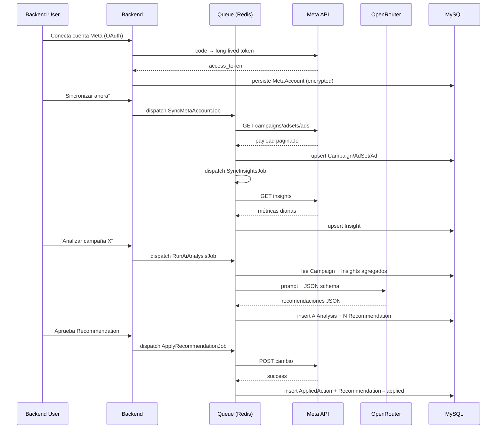

# Master Ads

## Resumen

**Master Ads** es un plugin SaaS multi-tenant para OctoberCMS 4 que optimiza campañas de Meta Ads (Facebook / Instagram) con asistencia de inteligencia artificial. Cada Workspace agrupa usuarios del backend, cuentas publicitarias de Meta, planes de suscripción y un historial completo de análisis y acciones aplicadas. El plugin está pensado para agencias y equipos in-house que necesitan iterar rápido sobre múltiples cuentas sin renunciar a trazabilidad ni a control humano sobre cada cambio.

La capa de IA usa **OpenRouter + Claude** como proveedor por defecto, pero la arquitectura es universal: cualquier LLM compatible con el contrato `AiProviderInterface` (OpenAI, Anthropic directo, modelos locales vía gateway compatible) puede registrarse desde el backend como un `AiProvider` adicional sin tocar código. Las respuestas del modelo se validan contra un JSON schema estricto antes de persistirse como `Recommendation`, y ninguna acción se aplica sobre Meta sin aprobación explícita del usuario (excepto en planes futuros con auto-apply guardrails).

El MVP es **backend-only** y completamente compatible con **RainLab Builder**: toda la estructura sigue las convenciones de Builder (`models/{Modelo}/fields.yaml`, `controllers/{nombre}/config_*.yaml`, migraciones planas en `updates/`), de modo que un desarrollador puede abrir el plugin en Builder y editarlo visualmente sin que el plugin pierda funcionalidad. El pipeline de sincronización con Meta y de análisis de IA es **totalmente asíncrono** vía colas Redis (`queue:work redis`), con reintentos exponenciales y dead-letter para fallos persistentes. Todas las operaciones quedan registradas en un **audit trail** completo (`AppliedAction`, `AiAnalysis`, `Recommendation` con historial inmutable) que permite reconstruir paso a paso el estado de cualquier cuenta en cualquier momento.

## Instalación

1. Copiar la carpeta del plugin a `plugins/aero/masterads/` (clonando este repo o como dependencia Composer).
2. Ejecutar las migraciones:
   ```bash
   php artisan october:up
   ```
3. Configurar las variables de entorno descritas en la sección siguiente.
4. Desde el backend (`/backend`), crear al menos:
   - Un **Plan** (`Master Ads → Billing → Plans`).
   - Una **Subscription** asociada al Workspace por defecto (`Master Ads → Billing → Subscriptions`).
   - Un **AiProvider** activo (`Master Ads → AI Providers`) marcado como `is_default = true`.
5. Conectar una **Meta Account** vía OAuth (`Master Ads → Meta Accounts → Conectar cuenta`).

A partir de este punto, los comandos artisan y los schedules quedan operativos.

## Variables de entorno

| Variable | Obligatoria | Descripción | Ejemplo |
|----------|:-----------:|-------------|---------|
| `META_APP_ID` | Sí | App ID de la aplicación Meta para Developers usada para OAuth. | `1234567890123456` |
| `META_APP_SECRET` | Sí | App Secret de la misma aplicación Meta. **No commitear.** | `abcd1234efgh5678…` |
| `META_OAUTH_REDIRECT` | Sí | URL absoluta del callback OAuth. Debe coincidir con la registrada en Meta. | `https://midominio.com/aero/masterads/oauth/meta/callback` |
| `META_GRAPH_API_VERSION` | No | Versión de la Graph API a usar. | `v19.0` (default) |
| `OPENROUTER_API_KEY` | Sí | API key de OpenRouter para el proveedor por defecto. | `sk-or-v1-…` |
| `OPENROUTER_BASE_URL` | No | Endpoint base de OpenRouter. | `https://openrouter.ai/api/v1` (default) |
| `OPENROUTER_DEFAULT_MODEL` | No | Modelo Claude por defecto si el `AiProvider` no especifica uno. | `anthropic/claude-3.5-sonnet` (default) |

## Comandos Artisan

| Comando | Descripción |
|---------|-------------|
| `php artisan masterads:sync-all [--workspace=ID] [--account=ID]` | Encola un `SyncMetaAccountJob` para todas las cuentas Meta activas. Filtra opcionalmente por `--workspace` o por `--account` específico. |
| `php artisan masterads:analyze --target-type=campaign --target-id=123 [--lookback-days=14]` | Lanza un análisis manual de IA sobre el target indicado (`campaign`, `adset` o `ad`). `--lookback-days` controla la ventana de insights agregados. |
| `php artisan masterads:analyze --auto` | Recorre todos los Workspaces con `settings.auto_analyze = true` y dispara un `RunAiAnalysisJob` por cada campaña activa cuyo último análisis sea anterior al umbral configurado. |
| `php artisan masterads:rotate-tokens [--days=7]` | Refresca los `access_token` de Meta Accounts cuyo `token_expires_at` esté dentro de los próximos `--days` días (default: 7). Dispara `MetaTokenRefreshFailed` si falla. |

## Schedule

El método `Plugin::registerSchedule()` registra tres tareas recurrentes contra el scheduler de OctoberCMS (cron `* * * * *` apuntando a `php artisan schedule:run`):

| Cron | Comando | Propósito |
|------|---------|-----------|
| Cada 4 horas | `masterads:sync-all` | Mantiene Campaign / AdSet / Ad / Insight sincronizados con Meta. |
| Diario 03:00 | `masterads:rotate-tokens --days=7` | Renueva long-lived tokens próximos a expirar antes de que caduquen. |
| Diario 06:00 | `masterads:analyze --auto` | Genera análisis automáticos para los Workspaces que lo tienen habilitado. |

## Permisos

Los permisos se registran en `Plugin::registerPermissions()` con prefijo `aero.masterads.*` y todos pertenecen al tab `Master Ads`.

| Permiso | Descripción |
|---------|-------------|
| `aero.masterads.access_plugin` | Acceso mínimo al menú principal del plugin. |
| `aero.masterads.manage_workspaces` | Crear, editar y borrar Workspaces; gestionar miembros y roles. |
| `aero.masterads.manage_meta_accounts` | Conectar, refrescar y desconectar cuentas de Meta vía OAuth. |
| `aero.masterads.access_campaigns` | Ver listados y detalles de Campaign / AdSet / Ad / Insight. |
| `aero.masterads.run_analysis` | Disparar análisis de IA manuales sobre targets concretos. |
| `aero.masterads.review_recommendations` | Ver y comentar Recommendation generadas por la IA. |
| `aero.masterads.apply_recommendations` | Aplicar Recommendation aprobadas sobre Meta (escritura real). |
| `aero.masterads.manage_ai_providers` | Crear, editar y marcar como default los `AiProvider` del Workspace. |
| `aero.masterads.manage_billing` | Gestionar Plans, Subscriptions y consultar UsageRecord. |

## Modelo de datos

13 modelos Eloquent (más la tabla pivote `workspace_user`), todos con prefijo de tabla `aero_masterads_`:

| Modelo | Descripción |
|--------|-------------|
| `Workspace` | Tenant raíz. Agrupa usuarios, cuentas Meta, planes y configuración (`settings` JSON, incluye `auto_analyze`). |
| `MetaAccount` | Cuenta publicitaria de Meta conectada vía OAuth. Persiste `access_token` cifrado, `token_expires_at` y metadatos de la Business. |
| `Campaign` | Campaña de Meta sincronizada. Hereda objetivo, status, daily/lifetime budget. |
| `AdSet` | Conjunto de anuncios dentro de una Campaign. Incluye targeting hash y bidding. |
| `Ad` | Anuncio individual dentro de un AdSet. Incluye creative_id y status. |
| `Insight` | Métricas diarias por target (campaign / adset / ad): impressions, reach, clicks, spend, conversions, etc. Indexado por `(target_type, target_id, date)`. |
| `AiAnalysis` | Ejecución concreta de IA sobre un target. Persiste prompt, raw response, modelo usado, coste estimado y estado. |
| `Recommendation` | Acción recomendada por la IA derivada de un `AiAnalysis`. Tiene `status` (pending / approved / rejected / applied / failed) y `payload` JSON validado por schema. |
| `AppliedAction` | Registro inmutable de un cambio efectivamente aplicado contra la Meta API. Guarda request, response y diff. |
| `AiProvider` | Proveedor de IA configurable por Workspace (o global). Driver, modelo, API key cifrada, `is_default`. |
| `Plan` | Plan de suscripción. Define cuotas (`max_meta_accounts`, `max_analyses_month`), precio y permisos especiales (`auto_apply_allowed`). |
| `Subscription` | Vínculo Workspace ↔ Plan con periodo de facturación, status y renovación. |
| `UsageRecord` | Métrica de consumo por Subscription (analysis / sync / applied_action). Base del enforcement de cuotas y reporting. |

## Flujo end-to-end



## Compatibilidad RainLab Builder

El plugin se mantiene 100 % editable desde RainLab Builder. Checklist verificada en cada release:

- ✅ Estructura `models/{Modelo}/fields.yaml` + `columns.yaml` para cada uno de los 13 modelos.
- ✅ Estructura `controllers/{nombre}/config_*.yaml` (`config_list.yaml`, `config_form.yaml`, `config_relation.yaml`) por cada controller backend.
- ✅ Migraciones planas en `updates/` registradas en `version.yaml` (sin migraciones programáticas fuera del flujo estándar).
- ✅ Permisos declarados con prefijo `aero.masterads.*` desde `Plugin::registerPermissions()`, todos asignables al tab `Master Ads`.
- ✅ Solo traits del core de Rain (`October\Rain\Database\Traits\Validation`, `SoftDelete`, `Nullable`, `Hashable`, `Encryptable`). **Ningún trait custom expuesto a Builder**, para no romper el editor visual.

## Estructura del plugin

```
plugins/aero/masterads/
├── Plugin.php
├── composer.json
├── routes.php
├── README.md
├── classes/
│   ├── Ai/
│   │   ├── AiProviderInterface.php
│   │   ├── AiProviderResolver.php
│   │   ├── AiResponse.php
│   │   ├── OpenRouterClient.php
│   │   ├── PromptBuilder.php
│   │   ├── RecommendationValidator.php
│   │   └── ResponseParser.php
│   ├── Billing/
│   │   ├── PlanLimiter.php
│   │   └── UsageMeter.php
│   ├── Concerns/
│   │   └── BelongsToTenantScope.php
│   ├── Engine/
│   │   ├── MetricsAggregator.php
│   │   ├── RecommendationApplierInterface.php
│   │   ├── RecommendationApplier.php
│   │   ├── RecommendationEngineInterface.php
│   │   └── RecommendationEngine.php
│   ├── Exceptions/
│   │   ├── AiProviderException.php
│   │   ├── MetaApiException.php
│   │   ├── MetaApiRateLimitException.php
│   │   ├── MetaOAuthException.php
│   │   ├── QuotaExceededException.php
│   │   └── UnsupportedActionTypeException.php
│   └── Meta/
│       ├── MetaApiClient.php
│       ├── MetaOAuthService.php
│       └── MetaTokenRefresher.php
├── console/
│   ├── AnalyzeCommand.php
│   ├── RotateTokensCommand.php
│   └── SyncAllCommand.php
├── controllers/
│   ├── AdSets.php          + adsets/{config_*.yaml,_*.htm}
│   ├── Ads.php             + ads/{...}
│   ├── AiAnalyses.php      + aianalyses/{...}
│   ├── AiProviders.php     + aiproviders/{...}
│   ├── Campaigns.php       + campaigns/{...}
│   ├── MetaAccounts.php    + metaaccounts/{...}
│   ├── Plans.php           + plans/{...}
│   ├── Recommendations.php + recommendations/{...}
│   ├── Subscriptions.php   + subscriptions/{...}
│   └── Workspaces.php      + workspaces/{...}
├── events/
│   ├── MetaAccountConnected.php
│   ├── MetaTokenRefreshFailed.php
│   ├── RecommendationApplied.php
│   ├── RecommendationGenerated.php
│   └── SyncCompleted.php
├── jobs/
│   ├── ApplyRecommendationJob.php
│   ├── RunAiAnalysisJob.php
│   ├── SyncInsightsJob.php
│   └── SyncMetaAccountJob.php
├── listeners/               # registrados en Plugin::boot()
├── observers/               # registrados en Plugin::boot()
├── lang/
│   └── es/
│       └── lang.php
├── models/
│   ├── Ad.php               + ad/{fields.yaml,columns.yaml}
│   ├── AdSet.php            + adset/{...}
│   ├── AiAnalysis.php       + aianalysis/{...}
│   ├── AiProvider.php       + aiprovider/{...}
│   ├── AppliedAction.php    + appliedaction/{...}
│   ├── Campaign.php         + campaign/{...}
│   ├── Insight.php          + insight/{...}
│   ├── MetaAccount.php      + metaaccount/{...}
│   ├── Plan.php             + plan/{...}
│   ├── Recommendation.php   + recommendation/{...}
│   ├── Subscription.php     + subscription/{...}
│   ├── UsageRecord.php      + usagerecord/{...}
│   └── Workspace.php        + workspace/{...}
└── updates/
    ├── version.yaml
    ├── create_workspaces_table.php
    ├── create_workspace_user_table.php
    ├── create_plans_table.php
    ├── create_subscriptions_table.php
    ├── create_usage_records_table.php
    ├── create_ai_providers_table.php
    ├── create_meta_accounts_table.php
    ├── create_campaigns_table.php
    ├── create_ad_sets_table.php
    ├── create_ads_table.php
    ├── create_insights_table.php
    ├── create_ai_analyses_table.php
    ├── create_recommendations_table.php
    └── create_applied_actions_table.php
```

## Roadmap

### Fase 2 — Crecimiento

- Soporte nativo para **Google Ads** reusando el mismo `RecommendationEngine` (nuevo `GoogleApiClient` + driver).
- **Auto-apply guardrails**: aplicación automática de Recommendation con baja-riesgo (presupuestos ±10 %, pausa de ads con CTR < umbral), siempre tras enfriamiento configurable y con kill-switch global.
- **Frontend público** (CMS pages + componentes) para que clientes finales vean dashboards de sus campañas sin entrar al backend.
- **Billing real** integrando Stripe / Paddle con webhooks, prorrateo, facturación automática y enforcement duro de cuotas.

### Fase 3 — Plataforma

- Conectores para **TikTok Ads** y **LinkedIn Ads** bajo el mismo contrato unificado.
- **A/B testing harness**: generar variantes de creative / copy / audience y medir lift automáticamente con significancia estadística.
- **White-label**: dominios custom por Workspace, branding configurable, multi-idioma del backend y exportación de informes con marca del cliente.

---

_Plugin: `Aero.MasterAds` — Validates Requirements 11.1, 12.1, 17.7, 18.1._
